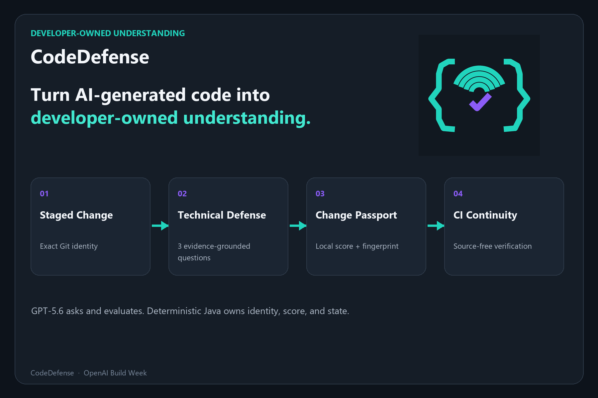
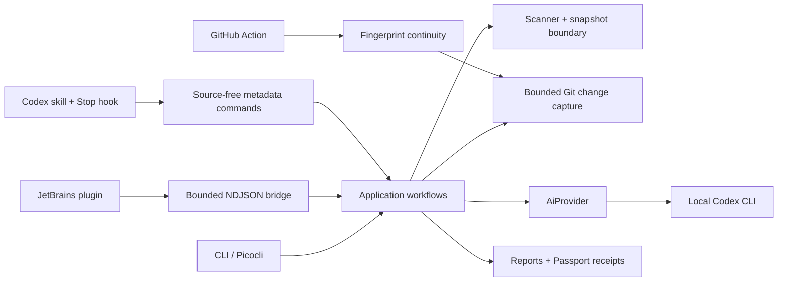

# CodeDefense

> **Turn AI-generated code into developer-owned understanding.**

[](https://github.com/DmitriyGrachev/CodeDefense/actions/workflows/build.yml)
[](https://github.com/DmitriyGrachev/CodeDefense/actions/workflows/codedefense-passport.yml)
[](https://adoptium.net/temurin/releases/?version=21)
[](LICENSE)

CodeDefense is a local Java 21 application that turns an AI-assisted repository or exact Git change into an evidence-grounded technical defense. Instead of generating more code or producing another AI review, it asks the developer to explain decisions, counterfactuals, and predicted test behavior, computes the score locally, and binds a source-free Change Passport to the exact diff.



## Why CodeDefense

AI coding assistants can produce a working change faster than its owner can explain it. A conventional review asks whether the code looks good; CodeDefense asks whether the developer understands the exact code they are about to keep.

- **Evidence-grounded:** every primary question cites a selected file and line range or a bounded changed hunk.
- **Adaptive:** a partial or incorrect answer can receive one focused follow-up.
- **Change-bound:** a Passport becomes `EXPIRED` when the staged diff changes.
- **Privacy-aware:** source is bounded, redacted, previewed, and sent only after confirmation.
- **Local authority:** Java owns the state machine, final score, readiness, persistence, and CI comparison.
- **Codex-native:** the CLI, JetBrains plugin, Codex skill/Stop hook, and GitHub Action share the same local boundaries.

## Requirements

- Java 21
- Maven
- Codex CLI installed locally and authenticated with `codex login`

CodeDefense does not require or use an OpenAI API key. It analyzes local directories only: it does not ingest GitHub URLs, execute analyzed source code, use a web interface, or use a database.

Verify the Java toolchain:

```powershell
java --version
mvn --version
```

Both commands must resolve Java 21. On a clean machine, install a Temurin/OpenJDK 21 JDK and Maven through the operating system package manager or their official distributions, then reopen the terminal before continuing.

Confirm the Codex prerequisite before a normal run:

```powershell
codex --version
codex login
```

## Install a release

Download `codedefense.jar` from the [latest GitHub release](https://github.com/DmitriyGrachev/CodeDefense/releases/latest), place it in any local directory, and verify the published SHA-256 value against `SHA256SUMS.txt`:

```powershell
Get-FileHash .\codedefense.jar -Algorithm SHA256
java -jar .\codedefense.jar --version
java -jar .\codedefense.jar --help
```

The release also contains the self-contained JetBrains and Codex plugin archives. Building from source remains available below.

## 60-second model-free evaluation

Judges and first-time users can verify the packaged CLI without Codex credentials or a model request:

```powershell
java -jar .\codedefense.jar --version
java -jar .\codedefense.jar --help
java -jar .\codedefense.jar sample --dry-run
```

The dry run sends no source content, makes no model request, and consumes no credits. See the [complete judge guide](docs/devpost/README-JUDGES.md) for the staged-change, JetBrains, Codex plugin, and CI paths.

## Build and run

```powershell
mvn clean verify
mvn package
java -jar target/codedefense.jar --help
java -jar target/codedefense.jar start . --dry-run
java -jar target/codedefense.jar sample --dry-run
java -jar target/codedefense.jar report
git add src/Example.java
java -jar target/codedefense.jar prove --staged .
java -jar target/codedefense.jar prove --commit HEAD .
java -jar target/codedefense.jar prove --range main...HEAD --focus failure-modes .
java -jar target/codedefense.jar passport --verify .
java -jar target/codedefense.jar passport show .
java -jar target/codedefense.jar passport list . --limit 10
java -jar target/codedefense.jar passport export . --format json --output passport.json
java -jar target/codedefense.jar passport timeline .
java -jar target/codedefense.jar passport handoff create . --output change.cdhandoff.json
```

`--dry-run` scans and previews the bounded snapshot without sending source content, invoking Codex, initializing the interactive terminal, or consuming credits. `--yes` bypasses confirmation and starts the structured analysis and interview through the locally authenticated Codex CLI. These requests consume Codex credits.

## Architecture

CodeDefense uses a small ports-and-adapters design. Picocli, JLine, Git, filesystem persistence, JetBrains, and process execution remain adapters around application and domain logic.



The model receives only explicitly confirmed bounded context. It proposes analysis, questions, evaluations, and report narrative through strict JSON schemas. Java validates all structured responses and remains authoritative for question count, follow-up limits, scoring, readiness, Passport identity, and persisted formats. See [the architecture notes](docs/architecture.md) for the dependency rule.

## Embedded sample project

Use the built-in sample to explore the complete workflow without selecting a repository path:

```powershell
java -jar target/codedefense.jar sample --dry-run
java -jar target/codedefense.jar sample
java -jar target/codedefense.jar sample --yes
```

`sample --dry-run` extracts the built-in project into a temporary directory, uses the same scanner and bounded snapshot preview as `start`, then removes that directory. It does not send source content, initialize JLine, invoke Codex, consume credits, or create a report. `sample` retains the normal preview and confirmation; `sample --yes` bypasses only that confirmation and can consume Codex credits. Both normal modes require the locally installed and authenticated Codex CLI described above.

The sample uses the same analysis, interview, and report pipeline as a local project. It is handled only as text: CodeDefense does not compile or execute any sample source. After any terminal path, its extracted workspace is removed. A completed normal run stores its report in the regular local report location, not beside the temporary sample.

The interactive defense asks exactly three repository-specific primary questions and may ask at most one focused follow-up for each. Entering exactly `skip` (case-insensitively) skips that turn locally without an evaluation request. Blank or overlong answers are rejected locally. Ctrl+C or end-of-input cancels safely with no report generated.

Codex evaluates answer quality, but CodeDefense computes question scores, the rounded overall score, skipped-primary count, and readiness classification locally. Those local values are authoritative: the report narrative cannot replace or alter them. A complete run makes at most eight model requests: one project analysis, up to six answer evaluations, and one report-narrative request. Question prompts and evidence locations are displayed; internal expected key points, evidence reasons, raw model JSON, and model internals are not.

## Understanding reports

After a successful analysis and completed interview, CodeDefense creates an Understanding Report in Markdown. It writes reports beneath the current user's home directory at:

```text
<user.home>/.codedefense/reports/
```

The file `<user.home>/.codedefense/latest-report.txt` is a local pointer to the most recently saved report. Run the following to print that report:

```powershell
java -jar target/codedefense.jar report
```

`report` is local-only: it does not invoke Codex and does not initialize JLine. If no completed report is available, it prints a safe explanatory message and exits successfully. Corrupt, unreadable, or unsafe report persistence data is reported safely with exit code `9`.

Report generation sends only the bounded report payload needed for the narrative: validated project metadata and overview, question prompts, evaluation concepts, and local scores/readiness. It does not send repository source or snapshots, user answers, expected key points, evidence metadata or reasons, prompt templates, schemas, or raw model JSON. The saved Markdown report includes answers only in escaped text fences; it never includes the source snapshot, expected key points, evidence reasons, raw model JSON, templates, schemas, or temporary paths.

If the report-narrative request fails for any non-cancellation Codex error, CodeDefense still creates and saves a deterministic local fallback report. Cancellation is preserved and no report is generated. A persistence failure also exits with code `9`.

For PowerShell scripts that read a report file, use explicit UTF-8 decoding:

```powershell
Get-Content -LiteralPath "$HOME\.codedefense\latest-report.txt" -Encoding utf8
```

## Git Change Passports

`prove` is a separate, opt-in defense mode for an exact staged index, resolved commit, or merge-base range:

```powershell
git add src/Example.java
java -jar target/codedefense.jar prove --staged .
java -jar target/codedefense.jar prove --commit HEAD .
java -jar target/codedefense.jar prove --range main...HEAD --focus testing .
java -jar target/codedefense.jar passport show .
java -jar target/codedefense.jar passport verify .
java -jar target/codedefense.jar passport gate --staged --format json .
java -jar target/codedefense.jar passport list . --limit 10
java -jar target/codedefense.jar passport export . --format json --output passport.json
java -jar target/codedefense.jar passport timeline .
java -jar target/codedefense.jar passport insights . --format json --limit 20
java -jar target/codedefense.jar passport show . --format json
java -jar target/codedefense.jar passport coverage . --format json
java -jar target/codedefense.jar passport ci-check --base main --head HEAD --policy advisory .
```

User-supplied commit and range refs are resolved once to immutable commit IDs before any diff capture. CodeDefense then uses bounded unified hunks, literal pathspecs, disabled external diff/textconv, and no shell command strings. It ignores unstaged working-tree content, previews the bounded redacted context, and requires explicit confirmation. Every `prove ... --dry-run` sends no source content and invokes no Codex.

`--focus` is a closed educational emphasis with four values: `balanced`, `architecture`, `failure-modes`, and `testing`. It changes the trusted analysis instruction, not Git capture, source budgets, the three required question categories, scoring, or follow-up limits. Focus is not a security, coverage, or approval claim.

The staged defense asks exactly three categories of question: **Decision**, **Counterfactual**, and **Test prediction**. The existing local scoring and readiness calculation apply. A completed run stores paired Markdown and versioned JSON receipt files under `<user.home>/.codedefense/change-passports/`; `<user.home>/.codedefense/latest-change-passport.txt` points to the latest Markdown artifact. The receipt is the strict machine-readable source of truth, while Markdown remains the human-readable view. Both retain only change metadata and structured verdict/score facts; model-generated questions, feedback, concepts, and user answers remain terminal-only.

`passport verify .` and the compatible legacy spelling `passport --verify .` are read-only: they do not modify the working tree, Git index, Passport artifact, or latest pointer. `passport show` displays the latest source-free score card; `passport show --format json` exposes a stable local adapter boundary; `passport list` shows recent receipts; and `passport export --format json` copies the exact validated receipt without overwriting an existing file. `passport timeline` groups up to 20 complete three-category attempts by exact diff fingerprint. `prove --retry ATTEMPT_ID` verifies that identity before starting a fresh full defense. Previous artifacts are never rewritten.

`passport insights . --format json --limit 20` aggregates only validated receipts for the current repository identity. It reports the three Java-owned category averages, the number of attempts and distinct defended changes, the strongest and practice-next categories, and at most ten recent overall scores in chronological order. It reads no Passport Markdown, creates no analytics database, sends no source, and never invokes Codex. Its bounded deterministic JSON omits project names, roots, timestamps, paths, questions, answers, feedback, evidence, model data, and user identity.

Portable handoffs use `passport handoff create`, `inspect`, and `match`. A `.cdhandoff.json` contains at most 20 source-free attempt summaries and a SHA-256 corruption checksum. Inspect is Git-free; match is Codex-free and compares the package with a separately captured local change. Imported handoffs never enter the trusted local Passport store. Integrity means only that bytes match the checksum: it is not a signature, identity, authorship, certification, or trust claim.

Staged source context is built from bounded unified hunks for at most 30 deterministically prioritized supported files. Repository paths are passed to Git as literal pathspecs, and HEAD/index identity is checked again after initial capture; if it changed, CodeDefense aborts and asks you to retry. Exact renames retain both old and new paths. A pure rename with no changed source lines is intentionally not enough to start a defense, and unchanged whole-file content is not sent as an artificial addition.

Passports and proof output exclude staged source, diffs, blobs, answers, raw model JSON, expected key points, and evidence reasons. JSON receipts are educational records, not approval to merge or deploy. The optional experiment below adds narrowly bounded local app-server matching; the default proof mode still performs no session matching. Neither mode adds browser integration, GitHub API access, signing, cloud storage, or a dashboard.

### Evidence Coverage Map

CodeDefense records which bounded changed hunks were referenced by the three primary defense questions. `passport coverage .` renders the latest current map in text or deterministic JSON. The IntelliJ bridge streams cumulative coverage after each primary question and shows a separate **Evidence Coverage** card with clickable hunk locations; unreferenced measurable hunks appear first.

Coverage is an evidence-use signal, not correctness, safety, or test coverage. It never changes the Java-owned score or readiness. The persisted sidecar contains only the exact Passport fingerprint, portable relative paths, hunk ordinals/ranges, reference state, and fixed category IDs. It contains no source, diff text, question text, answers, feedback, reasons, raw model output, or absolute paths.

### GitHub Actions Passport continuity

CodeDefense adds the source-free, model-free `passport ci-check` command and an advisory example workflow at `.github/workflows/codedefense-passport.yml`. The workflow checks out full history, builds with Java 21, compares each final `CodeDefense-Passport: sha256:<hash>` commit trailer with the deterministic parent-to-commit fingerprint, and writes a bounded summary to the GitHub Step Summary. It uses `contents: read`, invokes no Codex process, uses no API key, and uploads no repository content or Passport artifact.

`--policy advisory` returns success for matched, missing, and mismatched trailers while still reporting them. `--policy required` returns success only when every checked commit matches. Both policies fail when history cannot be checked safely. Ranges are limited to 50 non-root, non-merge commits; shallow or unavailable history is rejected. Trailer possession is not authentication and can be forged. Fingerprint continuity is not identity, correctness, safety, merge approval, or deployment approval.

### Live staged Passport gate

`passport gate --staged --format json .` is a read-only, staged-index-only status check. It returns exactly one of five states: `NO_STAGED_CHANGE` when the index has no entries; `UNDEFENDED` when the exact repository has no staged Passport history; `CURRENT` only when a staged receipt matches the full repository, change kind, base commit, index identity, and diff fingerprint; `EXPIRED` when staged history exists but that full identity changed; or `UNAVAILABLE` when Git capture, repository validation, or Passport storage cannot be read safely. A matching fingerprint alone is not enough for `CURRENT`.

The IntelliJ Tool Window refreshes this badge from project-open, Tool Window visibility, Git repository, `.git/index`, Passport-save, manual-refresh, and application-activation signals. Signals are debounced for 750 ms. Cached status is display-only: every supported staged-index commit callback requests a mandatory fresh check with a bounded timeout before deciding.

The commit integration is advisory. A non-`CURRENT` or unavailable fresh result offers `Defend change`, `Commit anyway`, or `Cancel`; `Commit anyway` applies only to that callback and is not persisted. CodeDefense installs no Git hook and does not hard-block commits. IntelliJ changelist or other non-index commit modes receive a separate unsupported-mode warning with `Commit anyway` or `Cancel`; they are not claimed as verified by the staged gate.

Gate checks launch only the local metadata adapter. Its deterministic JSON is capped at 256 KiB and contains state/reason, fingerprint, attempt and line/file counts, plus at most 30 relative paths for `EXPIRED`; it contains no source, diffs, questions, answers, feedback, or model output. Background and pre-commit gate checks never invoke Codex, start a defense, or consume Codex credits.

## Experimental consented Codex provenance

CodeDefense can also compare the exact defended Git hunks with file-change items from one local Codex thread selected by the user. It is disabled by default and requires a process-level kill switch plus three explicit per-run options:

```powershell
$env:CODEDEFENSE_EXPERIMENTAL_CODEX_PROVENANCE = "true"
java -jar target/codedefense.jar prove --staged . `
  --experimental-codex-provenance `
  --codex-thread <THREAD_ID> `
  --consent-codex-history `
  --dry-run
```

CodeDefense launches the installed Codex app-server over local stdio, performs the documented initialize/initialized handshake, and reads only the named thread. It never calls `thread/list`, guesses a recent thread, starts or resumes a turn, sends a model request, or reads Codex session/rollout files directly. The operation is bounded to 15 seconds, 1 MiB per JSONL line, 8 MiB total input, 1,000 relevant items, and 100 relevant paths.

Thread messages, reasoning, commands, tool output, patches, prompts, answers, the raw thread ID, and the thread working directory are transient and are never written to the Passport or receipt. Receipts retain only a domain-validated status, an opaque salted SHA-256 thread identity, the compatible Codex version, selected/matched counts, matched relative paths, and capture time. Older receipts remain schema compatible without provenance.

`Exact change match` means only that normalized, secret-redacted file-change evidence in the selected thread is consistent with every eligible defended Git hunk. `Partial path match`, `No match`, and `Unavailable` are informational. No provenance status changes questions, model evaluation, Java-owned scores, readiness, Passport validity, or CURRENT/EXPIRED identity. A match does not prove authorship, exclusive causation, review quality, safety, or that no later human edit occurred.

The IntelliJ plugin exposes the experiment only when it inherits the kill switch. A thread ID and consent are held for one run, sent in a bounded bridge request only after the core advertises `codexProvenanceV1`, and cleared immediately. The ID never appears in child-process arguments, plugin settings, notifications, or logs.

Offline fixture compatibility is recorded in [the app-server compatibility matrix](docs/codex-app-server-compatibility.md). A real local thread read is a separate opt-in acceptance gate and is never run by Maven or Gradle tests.

## Privacy model

CodeDefense selects at most 30 files and limits the snapshot to 120 KiB. It previews the selected relative paths before source content can be sent, excludes known secret and generated files, avoids symbolic links, and redacts common secret assignments as defense in depth. Repository content is treated as untrusted data: instructions found in source files, READMEs, comments, configuration, or generated text are not followed. Review the preview before confirming: redaction is not a guarantee that a repository contains no sensitive material.

### Supported inputs and hard limits

Whole-project scanning recognizes Java, Kotlin, Python, JavaScript/TypeScript, YAML, properties, TOML, and Markdown source/configuration files plus common build and application manifests such as `pom.xml`, Gradle settings, `package.json`, `pyproject.toml`, `requirements.txt`, `Dockerfile`, Compose files, and `application.*` configuration.

| Boundary | Limit |
|---|---:|
| Selected files | 30 |
| Snapshot sent to analysis | 120 KiB |
| Read prefix per source candidate | 24 KiB |
| Primary questions | exactly 3 |
| Follow-ups | at most 1 per primary question |
| GitHub CI commit range | 50 commits |

Dependency/build/generated directories, archives, binaries, images, lock files, `.env` files, keys, certificates, final symlinks, and paths escaping the real project root are excluded. Secret redaction is defense in depth, not a substitute for reviewing the preview.

## Testing

The default test suites never call real Codex and require no OpenAI API key:

```powershell
mvn clean verify
mvn package

cd jetbrains-plugin
.\gradlew.bat test verifyPlugin buildPlugin
```

GitHub Actions runs the Maven suite on Java 21 for both Ubuntu and Windows. A separate read-only Passport workflow checks commit-to-fingerprint continuity without invoking Codex or uploading Passport artifacts. Real Codex smoke tests are property-gated and manual only.

## Troubleshooting

| Symptom | Action |
|---|---|
| `java` or Maven uses an older JDK | Set `JAVA_HOME` to a Java 21 JDK, update `PATH`, and reopen the terminal. |
| `Codex CLI was not found` | Install Codex, verify `codex --version`, then restart the terminal/IDE. |
| Authentication is missing | Run `codex login` and confirm the same operating-system account launches CodeDefense. |
| `No eligible changed source files were found` | Stage a supported source or manifest file; generated, binary, secret, symlink, and unsupported files are intentionally ignored. |
| Passport is `EXPIRED` | The exact staged change moved after its defense. Preview and defend the current staged index again. |
| IntelliJ reports an unsupported commit mode | Enable the Git staging area and commit the exact staged index; changelist commits are not claimed as verified. |
| Plugin is incompatible | Use IntelliJ IDEA build `261.*` or `262.*` and install the ZIP produced by the current plugin build. |
| Structured Codex response is invalid | Retry once only when desired; the application rejects malformed output rather than trusting partial JSON. |

Expected failures are mapped to concise exit codes and should not print a Java stack trace. For diagnosis, reproduce first with `--dry-run`; that path does not invoke Codex.

## How Codex and GPT-5.6 power the project

The product uses the locally authenticated Codex CLI as its only AI runtime. GPT-5.6 Terra receives a bounded project snapshot or bounded Git hunk context and returns schema-constrained project analysis, three evidence-backed questions, answer evaluations, and optional report narrative. It cannot change the Java-owned final score, readiness, Passport identity, or CI result.

Codex also accelerated development of CodeDefense itself: it helped turn review findings into focused regression tests, exercise Windows launcher and privacy boundaries, build deterministic Git fixtures, and iterate on the CLI/JetBrains/Codex adapters. Product decisions remained explicit and local—for example, fixed three-category defenses, bounded disclosure, source-free receipts, advisory rather than automatic merge approval, and an off-by-default provenance experiment.

## Known MVP limitations and roadmap

- Local repositories only; no GitHub URL ingestion, cloud service, accounts, or database.
- CodeDefense does not execute analyzed source or tests and is not a security scanner.
- Scores are educational signals, not identity, authorship, correctness, safety, merge, or deployment approval.
- Secret detection is pattern-based and cannot guarantee that every sensitive value is removed.
- The JetBrains release targets IntelliJ IDEA `261.*` and `262.*` on Windows; other JetBrains products and operating systems are not claimed.
- The POSIX Codex plugin launcher is covered by automated contracts, but installed macOS/Linux acceptance remains pending.
- Experimental Codex thread provenance is disabled by default and excluded from the 0.1.1 acceptance claim.
- Passport trailers prove deterministic fingerprint continuity only; they are not signed and can be forged.

After the hackathon release, likely work is limited to user feedback, additional installed-platform acceptance, and deciding whether signed/source-free team handoffs are valuable. CodeDefense will not become a code generator, employee-ranking system, or automatic approval gate.

## License

CodeDefense is available under the [MIT License](LICENSE).

## Codex launcher support

- **Windows native installation:** `codex.exe` available through `PATH`.
- **Windows npm installation:** `codex.ps1` available through `PATH`, launched through Windows PowerShell with `-File`.
- **Linux/macOS:** native `codex` available through `PATH`.

On Windows, CodeDefense never directly launches `codex.cmd` or the extensionless npm Unix shim, and it does not use `cmd.exe /c` or PowerShell `-Command`.

## Codex plugin, skill, and advisory Stop hook

CodeDefense is also packaged as a repository-local Codex plugin. The bundled skill can show the staged Passport status, run a source-free staged preview, display the latest Passport score card, or summarize the repository Learning Radar. It never answers defense questions or starts a source-sending defense automatically. Actual defenses remain explicit, interactive workflows in the CodeDefense IntelliJ Tool Window or CLI.

The advisory `Stop` hook checks only the staged Change Passport identity after a Codex turn. It is silent outside a Git repository and when no staged change exists. Otherwise it reports `UNDEFENDED`, `CURRENT`, `EXPIRED`, or `UNAVAILABLE` with a safe next action. These states are educational signals only: they are never approval to merge or deploy. The hook launches the local CodeDefense metadata adapter, never launches `codex exec`, consumes no Codex credits, and emits no source, diff hunks, paths, project names, answers, questions, feedback, scores, readiness, model output, credentials, or user identity.

Build the executable and self-contained plugin archive on Windows:

```powershell
mvn package
.\scripts\package-codex-plugin.ps1
```

The archive is written to `target/codedefense-codex-plugin.zip`. The repository-local marketplace manifest is `.agents/plugins/marketplace.json`; add that marketplace in Codex, install **CodeDefense**, restart Codex, and review/enable the hook through `/hooks`. Java 21 is resolved from `JAVA_HOME` first and then `PATH`. Disable or uninstall the plugin from the Codex plugin UI to remove the skill and hook.

Linux and macOS use:

```sh
mvn package
./scripts/package-codex-plugin.sh
```

The bundled POSIX launcher contract is covered offline, but actual launcher acceptance on macOS/Linux remains pending; Windows packaging and launcher execution are verified locally. Hook trust is always controlled by Codex and is never bypassed by CodeDefense.

## IntelliJ IDEA plugin

CodeDefense includes a Windows-first Tool Window for IntelliJ IDEA 2026.1 Community and Ultimate editions. The plugin is a passive adapter: it launches the bundled shaded CLI JAR as a child Java process and exchanges bounded, versioned NDJSON over stdin/stdout. Git capture, privacy filtering, Codex access, question generation, scoring, and Passport persistence remain in the CLI. The plugin does not read project source, run Git itself, parse Passport Markdown, or place answers and model text in IDE logs or settings.

That bridge also supports protocol 2 evidence navigation and protocol 3 cumulative Evidence Coverage events. Primary questions carry only one to ten validated portable relative paths and line ranges; follow-ups carry no new evidence. The bridge never includes source snippets, evidence reasons, expected key points, or absolute paths. Protocols 1 and 2 remain decodable, and a CLI that cleanly rejects protocol 3 before any valid bridge event or possible Codex invocation is retried once with protocol 1. There is no fallback after a bridge event, confirmation, question, or any other point where source could have been sent.

Evidence links are resolved against the real project root before IntelliJ sees the file. Absolute paths, parent traversal, control characters, missing or unreadable files, directories, final symlinks, intermediate symlinks, paths outside the real root, and stale line ranges are not opened. IntelliJ resolves the `VirtualFile` only after those checks and opens a valid location at its cited line without reading or displaying source through the bridge.

The Tool Window also renders a repository-local Learning Radar from the source-free `passport insights` adapter: accessible bars for Decision, Counterfactual, and Test prediction, a recent overall-score trend, and a practice-next label. It loads in the background only when the Tool Window opens, after manual Refresh, or after a Passport is saved; ordinary Git/VFS gate signals do not start an insights read. Stale generations are discarded, unavailable results clear old scores, and the panel receives no source, paths, questions, answers, feedback, evidence, model data, or user identity.

The live staged Passport gate shows `NO_STAGED_CHANGE`, `UNDEFENDED`, `CURRENT`, `EXPIRED`, or `UNAVAILABLE` as text as well as color and supplies an advisory pre-commit check. Its optional **Attach current CodeDefense Passport fingerprint** checkbox is unchecked for every commit UI instance and is enabled only after a fresh `CURRENT` result. With explicit consent, the plugin can append exactly one source-free identity trailer, `CodeDefense-Passport: sha256:<64 lowercase hex>`. It never places scores, readiness, paths, source, repository or user identity, URLs, or timestamps in the commit message. Existing unrelated trailers and original line endings are preserved; a different, duplicate, mixed-case, or malformed CodeDefense trailer cancels attachment instead of being overwritten.

Trailer attachment performs two fresh staged-gate checks for the same full fingerprint and rereads the commit message immediately before mutation. If the staged identity or message changes, the commit is cancelled and the message remains untouched. This narrows the final IDE/Git handoff race but is not a cryptographic signature or merge approval. The refreshed Defense Cockpit keeps the live gate and staged actions at the top, the selector and session actions in responsive rows, the current question and safe evidence navigation beside the session flow, and the repository Learning Radar below it; controls remain keyboard-accessible in a narrow Tool Window.

Build the core artifact before the isolated plugin build:

```powershell
mvn clean package
cd jetbrains-plugin
.\gradlew.bat test verifyPlugin buildPlugin
```

The plugin ZIP is written beneath `jetbrains-plugin/build/distributions/` and contains the plugin JAR plus `cli/codedefense.jar`. Install it through **Settings → Plugins → Install Plugin from Disk**, then open **View → Tool Windows → CodeDefense**. The Tool Window supports staged, commit, and range selectors; the four closed defense focus values; dry preview; explicit source confirmation; one-question-at-a-time answer/skip controls; cancellation; source-free Passport status; safe path-and-line evidence links; and opening only the exact regular non-symlink Passport path returned by a successful core event.

Plugin settings contain only the bundled/override CLI choice, an optional validated JAR path, the default selector, and the default focus. They never contain Codex credentials, prompts, source, questions, or answers. The plugin targets IntelliJ IDEA builds `261.*` and `262.*` on Windows and declares the bundled `Git4Idea` dependency. Its staged refresh and advisory commit integration use public IntelliJ Platform and Git4Idea APIs; it does not claim support for other JetBrains products or operating systems.

## Credits and opt-in live smoke

Credits are consumed only by real structured `codex exec` requests. The default Maven suite never calls Codex. The live smoke test is opt-in, submits one small schema-constrained request, and consumes a small amount of Codex credit:

```powershell
.\scripts\live-smoke-test.ps1
```

```bash
./scripts/live-smoke-test.sh
```

The scripts show the resolved launcher, verify installation and authentication, then run only `CodexLiveSmokeTest` with `-Dcodedefense.live.codex=true`.

## Current status

The 0.1.1 release includes the executable CLI, bounded Codex adapter, adaptive interview, reports, embedded sample, exact-change Passports, command center, commit/range defense, attempt timelines, portable source-free handoffs, focus modes, JetBrains Defense Cockpit, advisory commit integration, repository Learning Radar, Codex skill/Stop hook, Evidence Coverage Map, and GitHub Actions Passport continuity. Experimental provenance remains off by default and outside the release acceptance claim.

See [the implementation plan](docs/codedefense-mvp-implementation-plan.md) and [the implementation checklist](docs/implementation-checklist.md).
