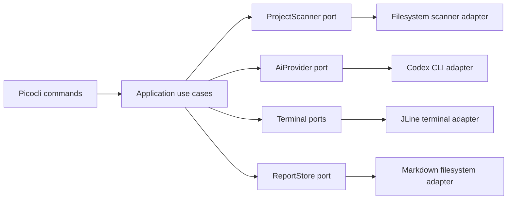

# CodeDefense CLI — MVP Architecture and Iteration Plan

> **Goal:** build a Java 21 command-line application that analyzes a local repository, conducts an adaptive technical defense using GPT-5.6 through the locally authenticated Codex CLI, and saves an educational understanding report.
>
> **Primary hackathon track:** Education.
>
> **Product promise:** “Prove that you understand your AI-assisted code.”
>
> **Implementation principle:** every iteration must end with a runnable, testable increment. No new feature is added after the MVP acceptance checklist passes.

---

## 1. Product definition

### 1.1 Problem

AI coding tools can generate working code faster than a junior developer can understand it. The user can often run the project but cannot explain:

- the architecture;
- the main request or data flow;
- why a particular implementation was chosen;
- failure modes;
- concurrency and transaction behavior;
- missing tests;
- what changes when the application is deployed in more than one process or container.

CodeDefense turns a local repository into an adaptive oral technical defense. It does not generate more code. It tests whether the repository owner understands the code already present.

### 1.2 Target user

The first version is designed for:

- junior developers;
- students;
- bootcamp participants;
- developers using Codex or another AI coding assistant;
- candidates preparing to explain a portfolio project.

### 1.3 Core user journey

```text
Install and sign in to Codex CLI
        ↓
Run CodeDefense in a local repository
        ↓
Preview which files will be included
        ↓
Confirm sending the bounded snapshot to Codex
        ↓
See the project map and critical technical topics
        ↓
Answer three repository-specific questions
        ↓
Receive immediate feedback and limited follow-ups
        ↓
Read and export an Understanding Report
```

### 1.4 MVP commands

```bash
java -jar codedefense.jar --help
java -jar codedefense.jar start [PATH]
java -jar codedefense.jar start [PATH] --dry-run
java -jar codedefense.jar sample
java -jar codedefense.jar sample --dry-run
java -jar codedefense.jar report
```

`PATH` defaults to the current working directory.

### 1.5 MVP options

```text
--dry-run          Scan and preview selected files without calling Codex; available for `start` and `sample`.
--yes, -y          Skip the confirmation prompt.
--model <MODEL>    Override the configured Codex model.
--no-color         Disable ANSI formatting.
```

No advanced configuration file is required for the first release. Internally, all defaults live in one immutable `CodeDefenseConfig` object so a config file can be added later without changing the use cases.

---

## 2. Strict MVP scope

### 2.1 Required

The MVP must:

1. run on Java 21;
2. build with Maven;
3. produce one executable shaded JAR;
4. analyze local directories only;
5. discover and prioritize supported text files;
6. exclude dependencies, generated files, build output, binary files, secrets files, and symlinks;
7. build a bounded repository snapshot;
8. show the selected file list before any model call;
9. invoke `codex exec` through `ProcessBuilder`;
10. rely on the user’s local Codex authentication rather than an OpenAI API key;
11. request structured JSON using a JSON Schema;
12. parse responses with Jackson;
13. validate model output semantically after JSON parsing;
14. present a project overview;
15. ask exactly three primary questions;
16. allow at most one adaptive follow-up per primary question;
17. support `skip`;
18. calculate the numeric score locally;
19. generate and save a Markdown report;
20. include a built-in Spring Boot sample repository;
21. include tests that never call the real Codex service;
22. handle expected failures without printing Java stack traces;
23. document installation and judge testing instructions.

### 2.2 Explicitly excluded

Do not implement before the hackathon deadline:

- GitHub URL ingestion;
- GitHub OAuth;
- private repository support;
- a web interface;
- Spring Boot or Spring Shell;
- a database;
- accounts or authentication inside CodeDefense;
- team collaboration;
- voice input;
- IDE plugins;
- code execution;
- test execution in analyzed repositories;
- automatic code modifications;
- multi-agent orchestration;
- vector databases or RAG infrastructure;
- repository history analysis;
- billing;
- cloud hosting;
- an OpenAI Platform API-key integration.

### 2.3 MVP simplification versus the earlier concept

The first version asks **three** primary questions, not five. Three questions are enough to demonstrate the adaptive workflow, fit a short demo, and reduce Codex calls. The architecture must make the number configurable later without changing the interview engine.

---

## 3. Technology choices

```text
Language:              Java 21
Build:                 Maven
CLI parsing:           Picocli
Interactive input:     JLine
JSON:                  Jackson
Testing:               JUnit 5
Test doubles:          hand-written fakes first; Mockito only where useful
Packaging:             Maven Shade Plugin
AI runtime:            Codex CLI invoked through ProcessBuilder
Model:                 gpt-5.6-terra by default
Analysis reasoning:    medium
Evaluation reasoning:  low
Report reasoning:      low
```

No dependency-injection framework is used. `CodeDefenseApplication` creates the object graph explicitly. This keeps startup simple and makes all dependencies visible.

---

## 4. Architecture

Use a lightweight ports-and-adapters architecture. Do not build a large DDD framework; only introduce interfaces at boundaries that are likely to change.



### 4.1 Dependency rule

Dependencies point inward:

```text
CLI / filesystem / Codex / terminal adapters
                    ↓
            application use cases
                    ↓
             domain models
```

Domain records must not import Picocli, JLine, Jackson annotations specific to the Codex adapter, or process-execution classes.

### 4.2 Main ports

```java
public interface ProjectScanner {
    ProjectSnapshot scan(Path root, ScanPolicy policy);
}

public interface AiProvider {
    ProjectAnalysis analyze(ProjectSnapshot snapshot);
    AnswerEvaluation evaluate(AnswerEvaluationRequest request);
    ReportNarrative generateReport(ReportGenerationRequest request);
}

public interface UserInput {
    String readAnswer(String prompt);
    boolean confirm(String prompt, boolean defaultValue);
}

public interface TerminalOutput {
    void renderBanner();
    void renderScanSummary(ScanSummary summary);
    void renderSelectedFiles(List<SourceFile> files);
    void renderProjectAnalysis(ProjectAnalysis analysis);
    void renderQuestion(int current, int total, TechnicalQuestion question);
    void renderEvaluation(AnswerEvaluation evaluation);
    void renderFinalReport(FinalReport report, Path savedPath);
    void renderError(String title, String detail);
}

public interface ReportStore {
    Path save(FinalReport report);
    Optional<String> readLatest();
}
```

### 4.3 Application use cases

```text
StartDefenseUseCase
- validates the path;
- runs preflight checks;
- scans the project;
- asks for confirmation;
- calls project analysis;
- launches the interview;
- computes the score;
- generates the narrative;
- saves the report.

RunSampleUseCase
- extracts the embedded sample into a temporary directory;
- delegates to StartDefenseUseCase;
- always deletes temporary files in a finally block.

ShowLatestReportUseCase
- loads and prints the latest report.
```

The Picocli command classes only translate CLI arguments into use-case calls and map exceptions to exit codes. They must not contain the workflow.

---

## 5. Proposed source tree

```text
codedefense/
├── pom.xml
├── README.md
├── LICENSE
├── docs/
│   ├── product.md
│   ├── architecture.md
│   ├── demo-script.md
│   └── decisions/
│       ├── 001-codex-cli-as-ai-runtime.md
│       ├── 002-bounded-snapshot.md
│       └── 003-local-scoring.md
├── scripts/
│   ├── live-smoke-test.ps1
│   └── live-smoke-test.sh
├── src/
│   ├── main/
│   │   ├── java/dev/codedefense/
│   │   │   ├── CodeDefenseApplication.java
│   │   │   ├── cli/
│   │   │   │   ├── RootCommand.java
│   │   │   │   ├── StartCommand.java
│   │   │   │   ├── SampleCommand.java
│   │   │   │   ├── ReportCommand.java
│   │   │   │   └── ExitCodes.java
│   │   │   ├── application/
│   │   │   │   ├── StartDefenseUseCase.java
│   │   │   │   ├── RunSampleUseCase.java
│   │   │   │   ├── ShowLatestReportUseCase.java
│   │   │   │   └── CodeDefenseConfig.java
│   │   │   ├── domain/
│   │   │   │   ├── ProjectSnapshot.java
│   │   │   │   ├── SourceFile.java
│   │   │   │   ├── ScanSummary.java
│   │   │   │   ├── ProjectAnalysis.java
│   │   │   │   ├── ProjectComponent.java
│   │   │   │   ├── TechnicalQuestion.java
│   │   │   │   ├── CodeEvidence.java
│   │   │   │   ├── AnswerEvaluation.java
│   │   │   │   ├── AnswerEvaluationRequest.java
│   │   │   │   ├── InterviewSession.java
│   │   │   │   ├── InterviewTurn.java
│   │   │   │   ├── Verdict.java
│   │   │   │   ├── Readiness.java
│   │   │   │   ├── ReportNarrative.java
│   │   │   │   ├── FinalReport.java
│   │   │   │   └── ReportGenerationRequest.java
│   │   │   ├── scanner/
│   │   │   │   ├── ProjectScanner.java
│   │   │   │   ├── FileSystemProjectScanner.java
│   │   │   │   ├── ScanPolicy.java
│   │   │   │   ├── ProjectFileFilter.java
│   │   │   │   ├── FilePrioritizer.java
│   │   │   │   ├── ProjectTypeDetector.java
│   │   │   │   ├── SecretRedactor.java
│   │   │   │   ├── SnapshotBudget.java
│   │   │   │   └── LineNumberFormatter.java
│   │   │   ├── ai/
│   │   │   │   ├── AiProvider.java
│   │   │   │   ├── CodexCliAiProvider.java
│   │   │   │   ├── CodexEnvironmentChecker.java
│   │   │   │   ├── CodexProcessRunner.java
│   │   │   │   ├── CodexCommandFactory.java
│   │   │   │   ├── StructuredCodexRequest.java
│   │   │   │   ├── PromptLoader.java
│   │   │   │   ├── PromptRenderer.java
│   │   │   │   ├── ModelResponseValidator.java
│   │   │   │   └── exception/
│   │   │   │       ├── CodexNotInstalledException.java
│   │   │   │       ├── CodexNotAuthenticatedException.java
│   │   │   │       ├── CodexExecutionException.java
│   │   │   │       ├── CodexTimeoutException.java
│   │   │   │       └── InvalidModelResponseException.java
│   │   │   ├── interview/
│   │   │   │   ├── InterviewEngine.java
│   │   │   │   ├── InterviewScorer.java
│   │   │   │   └── ReadinessClassifier.java
│   │   │   ├── terminal/
│   │   │   │   ├── UserInput.java
│   │   │   │   ├── TerminalOutput.java
│   │   │   │   ├── JLineUserInput.java
│   │   │   │   └── AnsiTerminalOutput.java
│   │   │   ├── report/
│   │   │   │   ├── ReportStore.java
│   │   │   │   ├── FileSystemReportStore.java
│   │   │   │   ├── MarkdownReportRenderer.java
│   │   │   │   └── CodeDefensePaths.java
│   │   │   └── sample/
│   │   │       └── SampleProjectExtractor.java
│   │   └── resources/
│   │       ├── prompts/
│   │       │   ├── analyze-project.md
│   │       │   ├── evaluate-answer.md
│   │       │   └── generate-report.md
│   │       ├── schemas/
│   │       │   ├── project-analysis.schema.json
│   │       │   ├── answer-evaluation.schema.json
│   │       │   └── report-narrative.schema.json
│   │       └── sample/
│   │           └── sample-project.zip
│   └── test/
│       ├── java/dev/codedefense/
│       │   ├── cli/
│       │   ├── application/
│       │   ├── scanner/
│       │   ├── ai/
│       │   ├── interview/
│       │   ├── report/
│       │   └── support/
│       │       ├── FakeAiProvider.java
│       │       ├── FakeUserInput.java
│       │       ├── CapturingTerminalOutput.java
│       │       └── ProjectFixtures.java
│       └── resources/
│           └── responses/
│               ├── valid-project-analysis.json
│               ├── invalid-project-analysis.json
│               ├── correct-evaluation.json
│               ├── partial-evaluation.json
│               └── report-narrative.json
```

This tree is a target, not a requirement to create every class immediately. A class is created only in the iteration that needs it.

---

## 6. Repository scanning design

### 6.1 Default scan policy

```text
Maximum selected files:       30
Maximum snapshot bytes:       120 KiB
Maximum bytes per source file: 24 KiB
Follow symbolic links:        no
Primary questions:            3
Follow-ups per primary topic: 1
```

The limits live in `CodeDefenseConfig`; no magic numbers are spread through the scanner.

### 6.2 Supported files

Exact names:

```text
README.md
README
pom.xml
build.gradle
build.gradle.kts
settings.gradle
settings.gradle.kts
package.json
pyproject.toml
requirements.txt
application.yml
application.yaml
application.properties
Dockerfile
docker-compose.yml
docker-compose.yaml
```

Extensions:

```text
.java
.kt
.kts
.py
.js
.jsx
.ts
.tsx
.yml
.yaml
.properties
.toml
.md
```

### 6.3 Always excluded

Directories:

```text
.git
.idea
.vscode
target
build
out
dist
coverage
node_modules
vendor
.gradle
.next
generated
generated-sources
```

Files and patterns:

```text
.env
.env.*
*.pem
*.key
*.p12
*.pfx
*.jks
*.keystore
*.class
*.jar
*.war
*.zip
*.tar
*.gz
*.png
*.jpg
*.jpeg
*.gif
*.pdf
package-lock.json
yarn.lock
pnpm-lock.yaml
```

### 6.4 Prioritization

Suggested deterministic score:

```text
README or build manifest                           +100
Application entry point / main class               +90
Controller / route / endpoint                      +70
Service / use case / scheduler / worker            +65
Repository / persistence / client / integration    +55
Configuration                                      +50
Domain model                                       +35
Tests                                              +20
File larger than 16 KiB                            -15
Path depth greater than 8                          -10
```

Tie-breakers:

1. higher priority;
2. shorter relative path;
3. alphabetical path.

### 6.5 Snapshot format

The prompt must receive one bounded plain-text snapshot:

```text
PROJECT
name: news-aggregator
detectedType: Java / Spring Boot
rootFiles: README.md, pom.xml

FILE: src/main/java/.../ArticleScheduler.java
LANGUAGE: java
LINES: 1-87
1 | package ...
2 |
3 | public class ArticleScheduler {
...
```

Line numbers are added locally before the prompt is built. Model evidence must refer to these paths and line numbers.

### 6.6 Privacy confirmation

Before the first Codex call, show:

- number of discovered files;
- number of ignored files;
- number of selected files;
- total selected bytes;
- selected relative paths;
- a warning that selected content is about to be sent through the authenticated Codex session.

Require explicit confirmation unless `--yes` is present.

### 6.7 Redaction

`SecretRedactor` redacts common assignments before content enters the snapshot:

```text
password=actual-value       → password=[REDACTED]
apiKey: actual-value        → apiKey: [REDACTED]
token = actual-value        → token = [REDACTED]
Authorization: Bearer ...   → Authorization: [REDACTED]
```

This is defense in depth, not a guarantee. The README must tell users not to analyze repositories containing sensitive material without reviewing the selected file list.

---

## 7. Codex CLI integration

### 7.1 Authentication model

CodeDefense does not store credentials. The user installs Codex CLI and signs in separately. The preflight check runs:

```bash
codex --version
codex login status
```

Expected states:

```text
Installed + authenticated       continue
Installed + unauthenticated     explain `codex login`, exit cleanly
Not installed                   show installation prerequisite, exit cleanly
Command timed out               show diagnostic, exit cleanly
```

### 7.2 Process boundary

`CodexProcessRunner` is the only class allowed to use `ProcessBuilder`.

It receives:

```java
public record StructuredCodexRequest(
        String model,
        String reasoningEffort,
        String prompt,
        String schemaResource,
        Duration timeout
) {}
```

It returns the final JSON string:

```java
public record CodexProcessResult(
        int exitCode,
        String finalMessage,
        String standardError,
        Duration duration
) {}
```

### 7.3 Command shape

The implementation should construct the equivalent of:

```bash
codex exec \
  --ephemeral \
  --sandbox read-only \
  --ask-for-approval never \
  --skip-git-repo-check \
  --color never \
  --model gpt-5.6-terra \
  --config 'model_reasoning_effort="medium"' \
  --cd <empty-temporary-workspace> \
  --output-schema <temporary-schema-file> \
  --output-last-message <temporary-result-file> \
  -
```

The prompt is written to stdin. It must never be passed as a command-line argument because repository snapshots can exceed operating-system command-line limits.

The temporary working directory does not contain the analyzed repository. The analyzed source exists only inside the bounded prompt snapshot. This prevents Codex from reading files that the scanner excluded and ensures the analyzed source code cannot be executed.

### 7.4 Model strategy

```text
Project analysis:  gpt-5.6-terra, medium reasoning
Answer evaluation: gpt-5.6-terra, low reasoning
Final narrative:   gpt-5.6-terra, low reasoning
```

The model can be overridden with `--model` or `CODEDEFENSE_MODEL`.

### 7.5 Timeout strategy

```text
Environment check: 15 seconds
Project analysis:   180 seconds
Answer evaluation:  120 seconds
Final report:       120 seconds
```

When a timeout occurs:

1. destroy the process;
2. wait briefly;
3. force-destroy if necessary;
4. delete temporary files;
5. show a concise error;
6. never print the complete prompt or source snapshot.

### 7.6 Windows compatibility

`CodexCommandFactory` must resolve both:

```text
codex
codex.cmd
```

Do not build a single shell command string. Pass a list of arguments to `ProcessBuilder` to avoid quoting and injection problems.

---

## 8. Structured response contracts

### 8.1 Project analysis

```java
public record ProjectAnalysis(
        String projectName,
        String projectType,
        String summary,
        List<String> mainFlow,
        List<ProjectComponent> components,
        List<String> criticalTopics,
        List<TechnicalQuestion> questions
) {}
```

```java
public record TechnicalQuestion(
        String id,
        String prompt,
        String learningGoal,
        List<String> expectedKeyPoints,
        List<CodeEvidence> evidence
) {}
```

```java
public record CodeEvidence(
        String path,
        int startLine,
        int endLine,
        String reason
) {}
```

Semantic validation after Jackson parsing:

- exactly three primary questions;
- every ID is unique;
- every question is nonblank;
- every question has at least one evidence item;
- every evidence path exists in the snapshot;
- start line is at least 1;
- end line is not less than start line;
- line range is inside the selected version of the file;
- no question asks for generic textbook knowledge without repository evidence.

### 8.2 Answer evaluation

```java
public enum Verdict {
    CORRECT,
    PARTIAL,
    INCORRECT,
    SKIPPED
}
```

```java
public record AnswerEvaluation(
        Verdict verdict,
        int score,
        String feedback,
        List<String> understoodConcepts,
        List<String> missingConcepts,
        String followUpQuestion
) {}
```

Rules:

- the AI response schema permits `CORRECT`, `PARTIAL`, and `INCORRECT`; `SKIPPED` is created only by Java;
- score is from 0 to 100;
- feedback is concise and educational;
- a follow-up is optional;
- no follow-up is asked after `CORRECT`;
- the application allows only one follow-up per primary question even if the model returns another;
- `skip` is represented locally and does not require an immediate model call.

### 8.3 Final narrative

The AI generates narrative, not the authoritative numeric score:

```java
public record ReportNarrative(
        String headline,
        String summary,
        List<String> strengths,
        List<String> knowledgeGaps,
        List<String> recommendedActions
) {}
```

Java computes:

- question scores;
- final score;
- readiness;
- skipped count;
- report metadata.

This avoids allowing the model to arbitrarily change the result after the interview.

---

## 9. Interview behavior

### 9.1 Default flow

For each of three primary questions:

1. show question number;
2. show evidence path and line range;
3. read the answer;
4. if answer is `skip`, record `SKIPPED`, assign zero, continue;
5. otherwise call `AiProvider.evaluate`;
6. show verdict, score, and concise feedback;
7. if verdict is `PARTIAL` or `INCORRECT` and a follow-up exists, ask one follow-up;
8. evaluate the follow-up;
9. store both turns;
10. continue to the next primary question.

### 9.2 Local scoring

For a primary question without follow-up:

```text
questionScore = first evaluation score
```

With follow-up:

```text
questionScore = max(
    firstScore,
    round(firstScore * 0.40 + followUpScore * 0.60)
)
```

Final score:

```text
overallScore = arithmetic mean of the three primary question scores
```

Readiness:

```text
80–100  STRONG_UNDERSTANDING
55–79   REVIEW_NEEDED
0–54    KNOWLEDGE_GAPS
```

The report must state that this is an educational signal, not approval to merge or deploy code.

### 9.3 Ctrl+C

Ctrl+C should:

- stop the current session;
- print `Session cancelled. No report was generated.`;
- return exit code 130;
- avoid a stack trace.

---

## 10. Report design

### 10.1 Storage location

Use a stable user-level directory:

```text
Windows: %USERPROFILE%\.codedefense\
Linux/macOS: ~/.codedefense/
```

Files:

```text
~/.codedefense/reports/<timestamp>-<project-slug>.md
~/.codedefense/latest-report.txt
```

`latest-report.txt` stores the path of the most recently completed report.

### 10.2 Markdown structure

```markdown
# CodeDefense Understanding Report

Project:
Analyzed:
Model:
Selected files:
Snapshot size:

## Score
72 / 100 — Review needed

> Educational signal only. This is not approval to merge or deploy.

## Project summary

## Main flow

## Strong areas

## Knowledge gaps

## Question-by-question review

### Question 1
Evidence:
Answer:
Verdict:
Feedback:
Final question score:

## Recommended next actions

## Privacy note
Only the bounded file snapshot listed above was included.
```

### 10.3 Failure fallback

If final narrative generation fails after the interview:

- do not discard the completed session;
- create a deterministic local report from question evaluations;
- mark the narrative section as unavailable;
- save the report;
- return a nonzero warning exit code only if the report could not be saved.

---

## 11. Error taxonomy and exit codes

```text
0    Success
2    Invalid CLI usage
3    Invalid or unreadable project path
4    No supported source files found
5    Codex CLI not installed
6    Codex authentication missing
7    Codex execution failed
8    Invalid structured model response
9    Report persistence failed
130  Cancelled by user
```

Expected errors are converted to user-friendly messages at the CLI boundary. Unexpected exceptions may be logged to a local diagnostic file, but the default terminal output must not include a stack trace.

---

# 12. Iteration plan

## Iteration 0 — Scope, documentation, and repository policy

### Deliverable

A greenfield repository with an approved architecture and no ambiguity about MVP boundaries.

### Work

- create `README.md` with a one-paragraph product definition;
- create `docs/product.md`;
- create `docs/architecture.md`;
- create three ADRs:
  - Codex CLI as AI runtime;
  - bounded snapshot instead of direct repository access;
  - local score calculation;
- add `.gitignore`;
- add MIT `LICENSE`;
- add `AGENTS.md` containing the strict scope and verification commands;
- create GitHub issues or a checklist matching Iterations 1–9.

### Tests

No behavior tests yet. Verify documentation contains no `TBD`, contradictory limits, or features outside the approved scope.

### Acceptance

- the repository clearly says local folders only;
- no OpenAI API key is required;
- no Spring dependency is planned;
- the default question count is three;
- the default snapshot is 30 files / 120 KiB;
- future features are listed separately from MVP.

### Suggested commit

```text
docs: define CodeDefense MVP architecture and scope
```

---

## Iteration 1 — Executable CLI foundation

### Deliverable

One shaded JAR with working help and placeholder commands.

### Files

Create:

```text
pom.xml
CodeDefenseApplication.java
cli/RootCommand.java
cli/StartCommand.java
cli/SampleCommand.java
cli/ReportCommand.java
cli/ExitCodes.java
```

### Work

- configure Java 21 compilation;
- add Picocli, JLine, Jackson, JUnit 5, and the Shade Plugin;
- configure the JAR manifest main class;
- add root command description and version;
- register `start`, `sample`, and `report`;
- return explicit exit codes;
- manually wire placeholder use cases;
- ensure `--help` and `--version` do not initialize Codex.

### Tests

- root help contains all three commands;
- `start` defaults its path to `.`;
- invalid option returns exit code 2;
- `report` placeholder does not throw.

### Verification

```bash
mvn test
mvn package
java -jar target/codedefense.jar --help
java -jar target/codedefense.jar --version
```

### Acceptance

The packaged JAR launches without Spring, without an API key, and without a Codex installation when only help/version is requested.

### Suggested commit

```text
feat: add executable Picocli application shell
```

---

## Iteration 2 — Deterministic filesystem discovery and filtering

### Deliverable

The application can safely discover supported files in a local directory.

### Files

Create:

```text
scanner/ProjectScanner.java
scanner/FileSystemProjectScanner.java
scanner/ScanPolicy.java
scanner/ProjectFileFilter.java
domain/SourceFile.java
domain/ScanSummary.java
```

### Work

- validate path existence, directory status, and readability;
- walk the tree without following symlinks;
- prune excluded directories before descending;
- allow only whitelisted names and extensions;
- collect discovery and ignore counters;
- reject a project with no supported source files;
- do not read full file contents yet.

### Tests

Use `@TempDir` for:

- missing directory;
- regular file passed as project root;
- unreadable path where the platform permits;
- excluded `target` and `node_modules`;
- supported `.java`, `.ts`, and `pom.xml`;
- excluded `.env`, `.pem`, and binary files;
- symlink not followed;
- empty project rejected.

### Acceptance

`start <path> --dry-run` can print discovery counts and stop before any Codex check.

### Suggested commit

```text
feat: discover and filter local project files
```

---

## Iteration 3 — Prioritization, redaction, and bounded snapshot

### Deliverable

A deterministic `ProjectSnapshot` that contains only the most useful bounded content.

### Files

Create:

```text
scanner/FilePrioritizer.java
scanner/ProjectTypeDetector.java
scanner/SecretRedactor.java
scanner/SnapshotBudget.java
scanner/LineNumberFormatter.java
domain/ProjectSnapshot.java
application/CodeDefenseConfig.java
```

### Work

- implement deterministic priority scoring;
- detect broad project type and framework hints;
- read candidate files using UTF-8 with graceful fallback;
- cap individual file content;
- redact common secret assignments;
- add stable line numbers;
- stop at 30 files or 120 KiB;
- preserve selected relative paths;
- render selected files and total selected bytes;
- implement confirmation;
- make `--dry-run` exit successfully after preview.

### Tests

- priority ordering;
- deterministic tie-breaking;
- exact 30-file cap;
- exact total-byte cap;
- oversized file truncation;
- line-number preservation;
- common secret redaction;
- deterministic snapshot for the same input;
- confirmation declined makes zero AI calls.

### Acceptance

```bash
java -jar target/codedefense.jar start . --dry-run
```

prints the project type, counters, selected paths, and snapshot size without requiring Codex authentication.

### Suggested commit

```text
feat: build privacy-aware bounded project snapshots
```

---

## Iteration 4 — Codex environment check and structured process adapter

### Deliverable

A reusable adapter that can invoke `codex exec`, write a prompt to stdin, and parse a schema-constrained final JSON message.

### Files

Create:

```text
ai/AiProvider.java
ai/CodexEnvironmentChecker.java
ai/CodexProcessRunner.java
ai/CodexCommandFactory.java
ai/StructuredCodexRequest.java
ai/PromptLoader.java
ai/PromptRenderer.java
ai/exception/*
```

### Work

- resolve `codex` / `codex.cmd`;
- run version and login status checks;
- build argument lists without shell string concatenation;
- create an empty temporary workspace;
- copy the requested schema resource to a temporary file;
- create a temporary output file;
- launch `codex exec` in read-only, ephemeral mode;
- write the prompt to stdin;
- enforce timeouts;
- capture bounded stderr;
- load the final output file;
- delete temporary artifacts in `finally`;
- map known exit failures to typed exceptions.

### Tests

No test calls real Codex.

- command arguments are in the expected order;
- prompt goes to stdin, not arguments;
- missing executable maps to `CodexNotInstalledException`;
- nonzero exit maps to `CodexExecutionException`;
- timeout destroys the process;
- output file is read;
- temporary files are deleted;
- stderr is truncated before being included in an error.

Implement a `ProcessLauncher` seam or equivalent fake so tests are cross-platform.

### Manual verification

Provide scripts:

```text
scripts/live-smoke-test.ps1
scripts/live-smoke-test.sh
```

They submit a tiny non-repository prompt with a trivial schema. They are never run in CI.

### Acceptance

A developer who has completed `codex login` can run the manual smoke test and receive valid JSON. Missing Codex and missing login produce clear instructions.

### Suggested commit

```text
feat: add structured Codex CLI process adapter
```

---

## Iteration 5 — GPT-5.6 project analysis and terminal overview

### Deliverable

CodeDefense converts a snapshot into a validated repository-specific project map and three evidence-backed questions.

### Files

Create:

```text
domain/ProjectAnalysis.java
domain/ProjectComponent.java
domain/TechnicalQuestion.java
domain/CodeEvidence.java
ai/CodexCliAiProvider.java
ai/ModelResponseValidator.java
resources/prompts/analyze-project.md
resources/schemas/project-analysis.schema.json
terminal/TerminalOutput.java
terminal/AnsiTerminalOutput.java
```

### Work

- define the project-analysis JSON Schema;
- write a prompt that explicitly forbids generic questions;
- include snapshot, limits, and expected behavior;
- parse JSON with Jackson;
- validate semantic constraints;
- reject hallucinated paths and invalid line ranges;
- render:
  - project name/type;
  - summary;
  - main flow;
  - components;
  - critical topics;
  - question count.

### Tests

- valid fixture maps to domain records;
- malformed JSON rejected;
- wrong question count rejected;
- duplicate question IDs rejected;
- missing evidence rejected;
- hallucinated path rejected;
- out-of-range line evidence rejected;
- renderer output contains summary and main flow.

### Acceptance

`start <fixture> -y` scans, calls Codex once, and displays a coherent project overview with three repository-specific questions prepared in memory.

### Suggested commit

```text
feat: analyze project architecture with GPT-5.6
```

---

## Iteration 6 — Adaptive interview engine

### Deliverable

A complete interactive three-question technical defense with immediate feedback and limited follow-ups.

### Files

Create:

```text
domain/AnswerEvaluation.java
domain/AnswerEvaluationRequest.java
domain/InterviewSession.java
domain/InterviewTurn.java
domain/Verdict.java
interview/InterviewEngine.java
interview/InterviewScorer.java
interview/ReadinessClassifier.java
terminal/UserInput.java
terminal/JLineUserInput.java
resources/prompts/evaluate-answer.md
resources/schemas/answer-evaluation.schema.json
```

### Work

- ask three primary questions in order;
- render evidence before each question;
- support `skip`;
- evaluate non-skipped answers through `AiProvider`;
- show verdict, score, and feedback;
- ask no more than one follow-up;
- ensure a second model-proposed follow-up is ignored;
- calculate primary-question score locally;
- calculate total score locally;
- map Ctrl+C to exit 130;
- keep the engine independent from Picocli and JLine through ports.

### Tests

Use `FakeAiProvider` and `FakeUserInput`:

- all answers correct;
- partial answer produces one follow-up;
- incorrect answer produces one follow-up;
- correct answer never produces follow-up;
- model asks for second follow-up but engine refuses;
- `skip` calls no evaluator;
- three primary questions always complete;
- score formula is correct;
- Ctrl+C/cancellation stops cleanly;
- AI failure during one evaluation displays an error and allows a controlled abort.

### Acceptance

A full interview can be completed using only fakes in automated tests and using real Codex manually.

### Suggested commit

```text
feat: conduct adaptive repository-specific interviews
```

---

## Iteration 7 — Final narrative, Markdown report, and `report` command

### Deliverable

Every completed interview produces a persistent, readable report.

### Files

Create:

```text
domain/Readiness.java
domain/ReportNarrative.java
domain/FinalReport.java
domain/ReportGenerationRequest.java
report/ReportStore.java
report/FileSystemReportStore.java
report/MarkdownReportRenderer.java
report/CodeDefensePaths.java
application/ShowLatestReportUseCase.java
resources/prompts/generate-report.md
resources/schemas/report-narrative.schema.json
```

### Work

- compute score and readiness before the report model call;
- ask GPT-5.6 only for narrative sections;
- prevent the model from changing the local score;
- render Markdown;
- store timestamped report under `~/.codedefense/reports`;
- update latest-report pointer atomically;
- implement `report`;
- implement deterministic fallback narrative if the final AI call fails;
- include analyzed files and privacy note.

### Tests

- score/readiness thresholds;
- report path sanitizes project names;
- Markdown contains all required headings;
- report does not include the full source snapshot;
- latest pointer update;
- missing latest report message;
- final AI failure still saves a useful report;
- persistence failure returns exit code 9.

### Acceptance

```bash
java -jar target/codedefense.jar report
```

prints the most recent completed report, and the report can be opened directly as Markdown.

### Suggested commit

```text
feat: generate and persist understanding reports
```

---

## Iteration 8 — Embedded sample project and judge-ready path

### Deliverable

A judge can test the product without finding or creating a repository.

### Files

Create:

```text
sample/SampleProjectExtractor.java
resources/sample/sample-project.zip
application/RunSampleUseCase.java
```

### Sample project content

A small Spring Boot-style news service with approximately 10–15 files and three intentional discussion points:

1. a scheduled method protected only by `synchronized`;
2. a retry path that can insert a duplicate article;
3. a database write followed by event publication without an outbox.

Suggested files:

```text
README.md
pom.xml
ArticleApplication.java
ArticleScheduler.java
ArticleService.java
ArticleRepository.java
Article.java
ArticleController.java
RetryingArticleProcessor.java
NotificationPublisher.java
ArticleCreatedEvent.java
OpenAiSummaryService.java
application.yml
```

The sample code is analyzed as text and is not compiled as part of CodeDefense.

### Work

- extract the ZIP to a temporary directory;
- run the exact same scanner, snapshot, analysis, interview, and report pipeline;
- label the session as sample mode;
- remove the extracted directory in `finally`;
- keep the generated report in the normal user report directory;
- document prerequisite `codex login`.

### Tests

- sample archive exists;
- extraction preserves paths;
- same scanner is invoked;
- temporary project is removed;
- fake-AI end-to-end sample test completes;
- report records sample project name.

### Acceptance

```bash
java -jar target/codedefense.jar sample
```

starts a complete real workflow, and `sample --dry-run` previews the embedded repository without consuming credits.

### Suggested commit

```text
feat: add embedded judge-ready sample workflow
```

---

## Iteration 9 — Reliability, packaging, documentation, and submission

### Deliverable

A release candidate that another person can run from a clean machine.

### Work

#### Reliability

- review all timeouts and cleanup paths;
- ensure no expected failure prints a stack trace;
- test Windows path quoting;
- test spaces and Unicode in project paths;
- test terminal without ANSI support;
- make output concise enough for the demo;
- ensure logs never contain source content by default.

#### Build

- run the complete test suite;
- run Maven verification;
- create one shaded JAR;
- verify manifest main class;
- optionally add a GitHub Actions workflow for `mvn verify` on Linux and Windows;
- create a tagged release and attach the JAR.

#### README

Include:

- problem statement;
- product GIF or screenshot;
- requirements;
- Java installation;
- Codex installation and `codex login`;
- exact run commands;
- sample mode;
- privacy model;
- architecture diagram;
- supported file types;
- limits;
- testing;
- troubleshooting;
- how Codex accelerated development;
- how GPT-5.6 powers the product;
- known MVP limitations;
- future roadmap;
- MIT license.

#### Hackathon material

- create a public repository;
- provide the release JAR;
- write the Devpost project description;
- record a public video shorter than three minutes;
- demonstrate:
  1. sample launch;
  2. selected files;
  3. project map;
  4. one incomplete answer;
  5. adaptive follow-up;
  6. final report;
- explain one concrete decision made by the developer rather than Codex;
- run `/feedback` in the main Codex development session and save the Session ID;
- verify every submitted link in a logged-out/incognito browser.

### Final verification

```bash
mvn clean verify
java -jar target/codedefense.jar --help
java -jar target/codedefense.jar start . --dry-run
java -jar target/codedefense.jar sample --dry-run
java -jar target/codedefense.jar report
```

Then perform one live `sample` run with authenticated Codex.

### Acceptance

The project satisfies the full MVP checklist below and has no open P0 defect.

### Suggested commit

```text
chore: prepare CodeDefense hackathon release
```

---

# 13. MVP acceptance checklist

## Product

- [ ] The problem is understandable in one sentence.
- [ ] The sample workflow starts with one command.
- [ ] The project overview is repository-specific.
- [ ] Exactly three primary questions are asked.
- [ ] Every question cites a selected path and line range.
- [ ] At least one adaptive follow-up can be demonstrated.
- [ ] Immediate feedback is educational rather than merely “right/wrong.”
- [ ] A Markdown report is saved and can be reopened.

## Safety and privacy

- [ ] No analyzed source code is executed.
- [ ] Symlinks are not followed.
- [ ] Secret files are excluded.
- [ ] Common secrets are redacted.
- [ ] Selected paths are shown before the model call.
- [ ] Confirmation is required unless `--yes` is used.
- [ ] Temporary prompt/schema/result files are deleted.
- [ ] Source content is not written to logs.
- [ ] The report contains references, not the entire repository snapshot.

## AI integration

- [ ] No OpenAI API key is required.
- [ ] Missing Codex CLI is explained.
- [ ] Missing Codex authentication is explained.
- [ ] `codex exec` receives prompts through stdin.
- [ ] The run is ephemeral and read-only.
- [ ] A JSON Schema is supplied.
- [ ] Jackson parsing is followed by semantic validation.
- [ ] Analysis uses GPT-5.6 Terra by default.
- [ ] The model can be overridden.
- [ ] All automated tests use fakes/fixtures, never live Codex.

## Engineering

- [ ] Java 21.
- [ ] Maven build.
- [ ] One executable JAR.
- [ ] No Spring.
- [ ] Application workflow is outside Picocli command classes.
- [ ] AI boundary is behind `AiProvider`.
- [ ] Scanner is behind `ProjectScanner`.
- [ ] Report persistence is behind `ReportStore`.
- [ ] Domain records do not depend on adapters.
- [ ] `mvn clean verify` passes.
- [ ] Expected failures return documented exit codes.
- [ ] Ctrl+C returns 130 without a stack trace.

## Submission

- [ ] Public repository or correct private access.
- [ ] Relevant license.
- [ ] Release JAR available.
- [ ] README contains complete setup instructions.
- [ ] Sample mode documented.
- [ ] Public demo video is under three minutes.
- [ ] Video explains Codex in development and GPT-5.6 in the product.
- [ ] Main development Codex `/feedback` Session ID recorded.
- [ ] Devpost links checked while logged out.

---

# 14. Credit-control policy

The default full run should use:

```text
1 call  project analysis
3 calls answer evaluation when there are no follow-ups
0–3 additional calls for follow-up answers
1 call  final narrative
```

Typical run: **5 calls**.  
Worst-case default run: **8 calls**.

Controls:

- 120 KiB snapshot hard limit;
- three primary questions;
- one follow-up per primary question;
- `skip` avoids an immediate evaluation call;
- `--dry-run` consumes no Codex credits;
- analysis uses medium reasoning;
- evaluations and report narrative use low reasoning;
- automated tests never call Codex;
- live smoke tests are manual and intentionally small.

The Codex session used to build the application is separate from the ephemeral Codex sessions started by the finished product. The Devpost `/feedback` Session ID should come from the main development session, not from CodeDefense runtime calls.

---

# 15. Recommended calendar order before the deadline

Use the official submission deadline as the hard external limit, but set an earlier personal cutoff.

```text
July 14: Iterations 0–1
July 15: Iterations 2–3
July 16: Iteration 4
July 17: Iteration 5; confirm hackathon Codex credits were requested
July 18: Iteration 6
July 19: Iterations 7–8
July 20: Iteration 9, README, release, video, Devpost draft
July 21: verification and submission only; no new features
```

Personal submission cutoff: **July 21 at 21:00 Europe/Bucharest time**, leaving a buffer before the official deadline.

---

# 16. Future extension points

These are enabled by the architecture but are not implemented in MVP.

## 16.1 Additional project sources

Add implementations of a future `ProjectSource` port:

```text
LocalDirectoryProjectSource
GitHubPublicProjectSource
ZipProjectSource
GitWorkingTreeDiffSource
```

## 16.2 Additional AI runtimes

Keep `AiProvider` stable and add:

```text
OpenAiApiProvider
LocalModelProvider
RecordedDemoProvider
EnterpriseCodexProvider
```

## 16.3 Interview modes

Introduce a `QuestionStrategy` later:

```text
General understanding
Architecture defense
Testing defense
Security defense
Performance defense
Interview preparation
```

## 16.4 Language profiles

Introduce `LanguageProfile` implementations:

```text
JavaSpringProfile
TypeScriptNodeProfile
PythonFastApiProfile
GenericProfile
```

Profiles can change prioritization and question guidance without changing the scanner core.

## 16.5 More interfaces

The same application use cases can later be driven by:

```text
Web UI
IDE plugin
GitHub Action
ChatGPT plugin
Desktop application
```

The CLI remains one adapter.

## 16.6 Session history

Add a `SessionStore` for:

- resume;
- progress over time;
- comparing reports;
- spaced repetition;
- teacher dashboards.

Do not introduce it until the one-session MVP is stable.

---

# 17. Stop rules

Once Iteration 8 passes:

1. no new user-facing features;
2. only defects, documentation, demo reliability, and submission work;
3. no refactor unless it fixes a concrete problem;
4. no dependency replacement unless the current dependency blocks packaging;
5. no change from local folders to GitHub URLs;
6. no increase from three questions to five before submission;
7. no web interface;
8. no “one more AI agent.”

The winning version is the smallest version that gives judges a coherent start-to-report experience.
